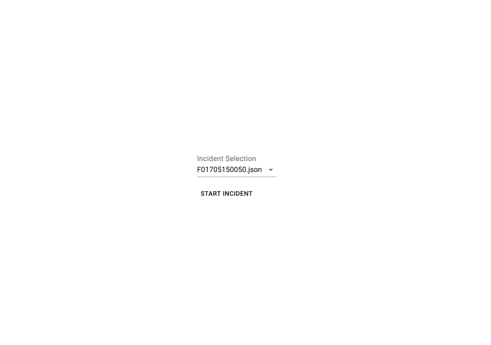
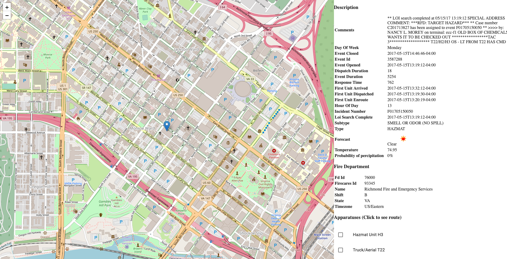
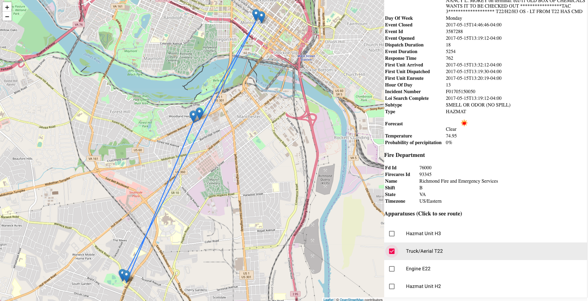

## Incidents demo app ##
MERN stack app without the DB using Docker.

Load incidents from file.  Add incidents to data folder under server.  Load under selection route in client.

Displays data from incident and enriches with weather data.  Didn't get a chance to enrich with other data.

Click an apparatus at bottom to see the route it took.

~5 hours of coding spent so far

### To run: ###
```
 docker-compose build
 docker-compose up
```

### Screen shots ###


